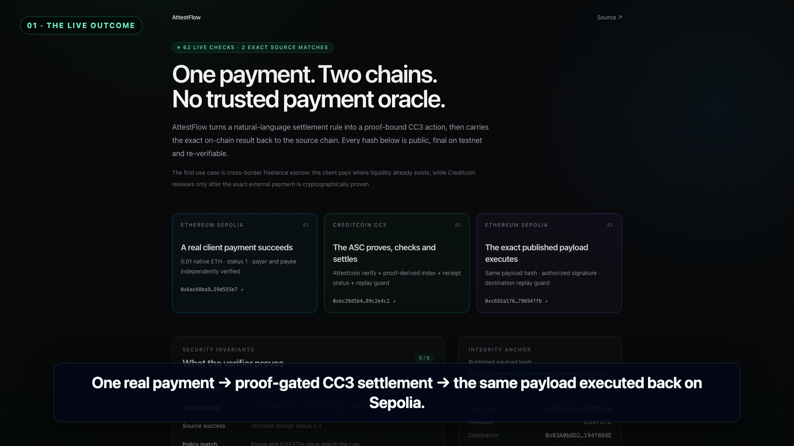

# AttestFlow — Proof-Gated Cross-Chain Payments

<p align="center">
  
</p>

> A natural-language payment agent that observes Ethereum Sepolia, proves the source transaction through Attestcoin, settles escrow on Creditcoin CC3, and carries the exact settlement result back to Sepolia.

**BUIDL CTC 2026 Fall · AI track**

[](https://github.com/ximilu0114-droid/ximilu-hackson/actions/workflows/ci.yml)
[](https://github.com/ximilu0114-droid/ximilu-hackson/actions/workflows/codeql.yml)
[](LICENSE)
[](https://creditcoin-testnet.blockscout.com/address/0x4E7410Ebf41C213378E1D8aA4423323303086bF6)
[](https://repo.sourcify.dev/102031/0x4E7410Ebf41C213378E1D8aA4423323303086bF6)

## The 30-second judge path

AttestFlow is not a mocked bridge animation. Its current evidence is a single, linked transaction story across two public testnets:

| Stage | Public evidence |
|---|---|
| Client pays `0.01 ETH` on Sepolia | [`0x6ac68b…55e7`](https://sepolia.etherscan.io/tx/0x6ac68ba923494389999206236504123521d8ecdb9463f60aa52da47d59d555e7) |
| Attestcoin proof gates settlement on CC3 | [`0xec29d5…e4c2`](https://creditcoin-testnet.blockscout.com/tx/0xec29d5b4046d5557c014d6720e6d3799ba0f0b41e31a71147240a09b89c2e4c2) |
| The exact published payload executes on Sepolia | [`0xc692a1…47fb`](https://sepolia.etherscan.io/tx/0xc692a176f78b1541104e9e0a18f9a8404c585b15e9be2c695df3d118796947fb) |

[](https://github.com/ximilu0114-droid/ximilu-hackson/raw/refs/heads/main/docs/attestflow-demo-review.mp4)

Click the poster for the public 2:18 review cut. It uses GitHub's raw-file endpoint because the repository blob viewer does not preview the tracked MP4.

The repository includes a machine-checkable evidence manifest. It re-reads both chains, validates 62 assertions, checks both replay guards, compares the CC3 and Sepolia payload hashes, and proves that deployed runtime bytecode matches the local Solidity build:

```bash
npm ci
npm run verify:evidence
# → { "status": "SUCCESS", "checks": 62 }
```

A fresh anonymous clone rehearsal on 2026-09-01 established the baseline. The current five-gate evaluator additionally checks two Sourcify exact matches and generates a multi-block shared batch proof; the latest committed rehearsal is recorded in [`docs/submission-checklist.md`](docs/submission-checklist.md).

For the complete evaluator path after installation, one command runs every local gate, re-reads both public chains, checks both exact source matches, and generates fresh single and multi-block batch proofs:

```bash
npm run judge:verify
# final verdict → { "step": "judge-verify", "status": "SUCCESS", ... }
```

For a visual evidence brief, run the dashboard and open [`http://localhost:3100/judge`](http://localhost:3100/judge).

For the fastest judge-ready narrative, open the **[nine-slide pitch deck](docs/attestflow-pitch-deck.pdf)**. Its editable source is [`docs/attestflow-pitch-deck.pptx`](docs/attestflow-pitch-deck.pptx); the [evidence whitepaper](docs/whitepaper.pdf) and [integration guide](docs/integration.md) provide the technical deep dive.

### 2:18 demo cut

The repository includes a judge-facing 1080p review cut with burned-in captions: **[public MP4 download](https://github.com/ximilu0114-droid/ximilu-hackson/raw/refs/heads/main/docs/attestflow-demo-review.mp4)** ([tracked file](docs/attestflow-demo-review.mp4)). It shows the product before 0:40, the current public transactions, the proof/security boundary, the honest Writability limitation, and an actual five-gate judge-verifier run.

The cut is deterministic and reproducible from public evidence:

```bash
npm run render:demo-video
```

The renderer requires macOS `say`, Google Chrome, and `ffmpeg`/`ffprobe`. It builds the production dashboard, loads the factual demo fixture, captures the current explorer evidence, runs the complete five-gate `judge:verify`, and assembles the narrated video plus `.srt` and poster artifacts. A public/unlisted viewing URL will be added only after anonymous-access testing.

## Real-world wedge

A cross-border freelancer can be paid on the chain where a client already has liquidity while a pre-funded Creditcoin escrow releases automatically only after that exact payment is proven. No operator, indexer, or LLM gets to assert that money arrived. The same proof-gated primitive can power marketplace escrow, invoice factoring, treasury automation, and agent-to-agent commerce.

## Why this needs Attestcoin

An LLM can understand “release 10% when I receive at least 0.01 ETH,” but it cannot be trusted to assert that the payment happened. AttestFlow separates three responsibilities:

- **Intent:** a natural-language rule becomes a fail-closed, inspectable draft; its exact money fields must be activated before autonomous execution.
- **Truth:** the Attestcoin Protocol proves the source transaction and source-chain continuity.
- **Execution:** the ASC independently checks success, policy match, transaction identity, replay, and escrow solvency before releasing CTC.

```text
Ethereum Sepolia                          Creditcoin CC3 Testnet
─────────────────                         ──────────────────────
client payment
      │
      ├─ agent scans only attested height
      ├─ ProofBuilder: Merkle + continuity proof
      │                                      │
      └─────────────────────────────────────►│ AttestFlowASC.settle()
                                             │  0x0FD2 verify()
                                             │  calculateTxIndex()
                                             │  receipt status == 1
                                             │  policy + replay + escrow
                                             │  release CTC
                                             │  emit MessagePublished
                                             └──────────────┐
                                                            │ exact payload
Ethereum Sepolia                                           │
─────────────────                                           │
InboxDemo.execute(payload, signature) ◄─────────────────────┘
      └─ signature + replay validation → MessageExecuted
```

## Attestcoin integration depth

| Protocol surface | Production use in this repository |
|---|---|
| **ChainInfo precompile (`0x0FD3`)** | The agent fails closed unless the live CC3 registry maps Ethereum Sepolia (`chainId 11155111`) to configured `chainKey 1`; the proof smoke test also discovers the chain at runtime. |
| **ProofBuilder** | Builds real Merkle and continuity proofs through the official hosted prover. The watcher scans only the attested window; `waitUntilHeightAttested` remains available for a specified fresh transaction. |
| **Shared batch proofs** | Multi-payment backlog recovery calls `getBatchProof()` for 2–10 matches, binds every returned hash and Merkle-derived index, and requires native `verifyBatch()` success before any member enters settlement. `npm run e2e:batch-proof` exercises three distinct attested blocks without gas. |
| **BlockProver (`0x0FD2`)** | `AttestFlowASC.settle()` calls `verify()` synchronously. A settlement cannot be created from an agent assertion alone. |
| **Protocol transaction encoding v1** | The ASC decodes attested transaction fields and the receipt. It supports native ETH plus ERC-20 `transfer` and `transferFrom`. |
| **Proof-derived transaction identity** | The ASC calls `calculateTxIndex()` and rejects a caller-supplied index that differs from the Merkle path, closing an otherwise exploitable replay-key gap. |
| **Writability semantics** | Until official Outbox/Inbox contracts are deployed on this testnet, the ASC publishes the destination-bound payload and an explicit adapter performs sign → deliver → validate against `InboxDemo`. |
| **Compiler identity** | Both deployed contracts are Sourcify `exact_match` for creation and runtime bytecode. `npm run verify:sources` checks the public v2 records and can republish the exact Hardhat compiler input without a deployment key. |

See the judge-oriented [`docs/attestcoin-depth.md`](docs/attestcoin-depth.md) ledger and [`docs/integration.md`](docs/integration.md) for capability-by-capability evidence, byte layouts, and threat boundaries.

## AI trust boundary

AI proposes; it never authorizes. Before any optional model call, the local compiler requires an explicit Sepolia self-payment rule with exactly one supported asset/amount and payout percentage. A model response must use the exact three-field string schema and agree byte-for-byte with the locally extracted money fields. The dashboard stores the result as an inactive draft and shows the exact asset, threshold, and payout percentage before activation; activation revalidates persisted values. In CLI mode, deterministic compilation of a fully explicit command remains one-step and reproducible, while model-assisted output is stored as `REVIEW_REQUIRED` until a later `--activate <rule-id>` command.

After activation, neither the parser nor the model can assert that a payment happened. Attestcoin supplies source-chain truth and the ASC remains the only money-moving authority. The adversarial cases and exact decision-rights matrix are in [`docs/ai-trust-boundary.md`](docs/ai-trust-boundary.md).

## Security properties

The source transaction must pass every gate below in one CC3 transaction:

1. valid Attestcoin inclusion and continuity proof;
2. proof-derived transaction index equals the supplied index;
3. attested receipt status equals `1` (the precompile alone does not check success);
4. decoded recipient, asset, calldata, and amount match the stored policy;
5. the proof-derived source transaction ID is unused;
6. the policy fixes the beneficiary and destination contract;
7. escrow covers the deterministic payout.

The destination Inbox separately verifies the authorized signature and rejects payload replay. The agent checkpoints immediately after the irreversible CC3 leg; if destination RPC access fails, a restart recovers the original `MessagePublished` payload from chain logs and completes only the missing leg. The v2 live run exercised this recovery path.

## Reproduce locally

Requirements: Node.js 20+ and npm. The default tests and public evidence verifier need no wallet or API key.

`npm ci` may report development-toolchain advisories from the deliberately pinned Hardhat 2.x stack. `npm run ci` finishes with an explicit production-only audit; the verified production result is zero vulnerabilities. Hardhat remains pinned at `2.26.5` because later EDR builds are incompatible with the CC3 testnet/fork behavior used by this repository.

```bash
git clone https://github.com/ximilu0114-droid/ximilu-hackson.git
cd ximilu-hackson
npm ci

npm run judge:verify       # recommended: all five gates below in one command
npm run ci                 # typecheck + 32 tests + web build + production audit
npm run verify:evidence    # 62 live, cross-chain assertions
npm run verify:sources     # Sourcify creation + runtime exact matches
npm run e2e:batch-proof    # 3 blocks, shared continuity proof, verifyBatch()
npm run e2e:proof          # fresh real proof + read-only on-chain verification; no gas
```

### Run the dashboard

```bash
npm run dev --prefix web
# product UI:     http://localhost:3100
# judge evidence: http://localhost:3100/judge
```

### Run the autonomous agent

Copy `.env.example` to `.env` and use a fresh, testnet-only wallet. Dry mode performs discovery, proof generation, source decoding, policy validation, and a signed return payload without spending gas:

```bash
npm run start --prefix agent -- \
  --rule "当我在 Sepolia 收到 ≥0.01 ETH 时，按 10% 释放" --once
```

Live mode additionally needs funded CC3 CTC and Sepolia ETH:

```bash
LIVE=1 \
ASC_ADDRESS=0x4E7410Ebf41C213378E1D8aA4423323303086bF6 \
INBOX_ADDRESS=0x83A0b8D26Dd28094eE0CA74E57e79028194f868E \
npm run start --prefix agent -- \
  --rule "When I receive at least 0.01 ETH on Sepolia, release 10%"
```

Use `--tx 0x… --once` with a known, already-attested transaction for a deterministic demo or recovery run. It bypasses only discovery; the real source transaction, proof, CC3 settlement, and destination delivery follow the same path.

When an optional LLM compiles a CLI rule, inspect the logged asset, minimum, and ratio, then activate the stored draft in a separate invocation:

```bash
npm run start --prefix agent -- --activate r1 --once
```

## Deployed artifacts

| Artifact | Address | Source identity |
|---|---|---|
| AttestFlowASC · CC3 Testnet | [`0x4E7410Ebf41C213378E1D8aA4423323303086bF6`](https://creditcoin-testnet.blockscout.com/address/0x4E7410Ebf41C213378E1D8aA4423323303086bF6) | [Sourcify exact match](https://repo.sourcify.dev/102031/0x4E7410Ebf41C213378E1D8aA4423323303086bF6) |
| InboxDemo · Ethereum Sepolia | [`0x83A0b8D26Dd28094eE0CA74E57e79028194f868E`](https://sepolia.etherscan.io/address/0x83A0b8D26Dd28094eE0CA74E57e79028194f868E) | [Sourcify exact match](https://repo.sourcify.dev/11155111/0x83A0b8D26Dd28094eE0CA74E57e79028194f868E) |
| BlockProver precompile | `0x0000000000000000000000000000000000000FD2` | native CC3 precompile |
| ChainInfo precompile | `0x0000000000000000000000000000000000000FD3` | native CC3 precompile |

ABI snapshots live in [`deployments/`](deployments/); the evidence record is source-controlled at [`evidence/live-e2e-v2.json`](evidence/live-e2e-v2.json).

## Repository map

```text
contracts/   ASC, destination Inbox, mocks, deployment and live E2E scripts
agent/       rule parser, attested-window watcher, proof/settlement/recovery loop
web/         Next.js dashboard plus the /judge evidence brief
scripts/     single/batch proof probes, source/evidence verifiers, and video renderer
evidence/    immutable cross-chain evidence manifests and factual demo fixture
docs/        pitch deck, whitepaper, integration deep-dive, demo cut, submission kit
```

Copy-ready DoraHacks text is in [`docs/submission-copy.md`](docs/submission-copy.md). Only the team identity and final public video URL remain intentionally blank.

## Third-party services disclosure

- **Attestcoin hosted prover:** `https://prover.cc3-testnet.creditcoin.network`.
- **Public RPC endpoints:** `ethereum-sepolia-rpc.publicnode.com` and `rpc.cc3-testnet.creditcoin.network` by default; both are configurable.
- **Optional LLM:** setting `OPENAI_API_KEY` enables an OpenAI-compatible parsing/Q&A endpoint. It is never trusted for proof verification or settlement. All core flows and recorded evidence work with the deterministic local parser.
- **Explorers:** Etherscan and the Creditcoin explorer are evidence links only.
- **Source verification:** Sourcify API v2 stores the public exact compiler-input matches; no key or proprietary service is required.

## Honest boundary

Creditcoin's official Writability Outbox/Inbox contracts are not available on the target testnet at the time of submission. The return leg therefore demonstrates the documented publish → sign → deliver → validate interface with one authorized relayer, not an attestor quorum. The limitation is explicit in the UI, whitepaper, and integration guide; the Readability settlement leg is fully verified by the native Attestcoin precompile.

## License

MIT — see [`LICENSE`](LICENSE).
